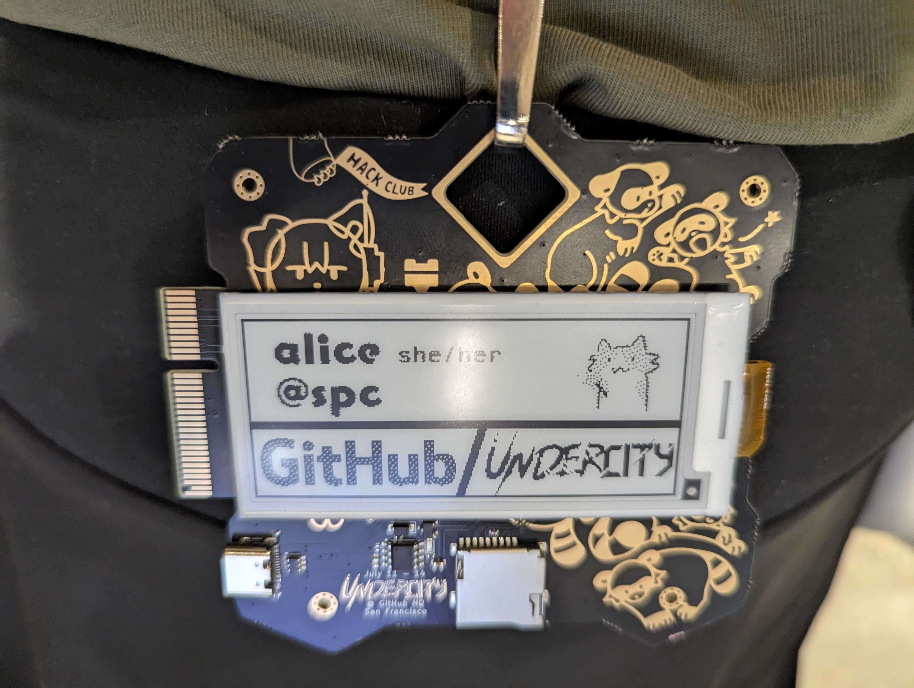
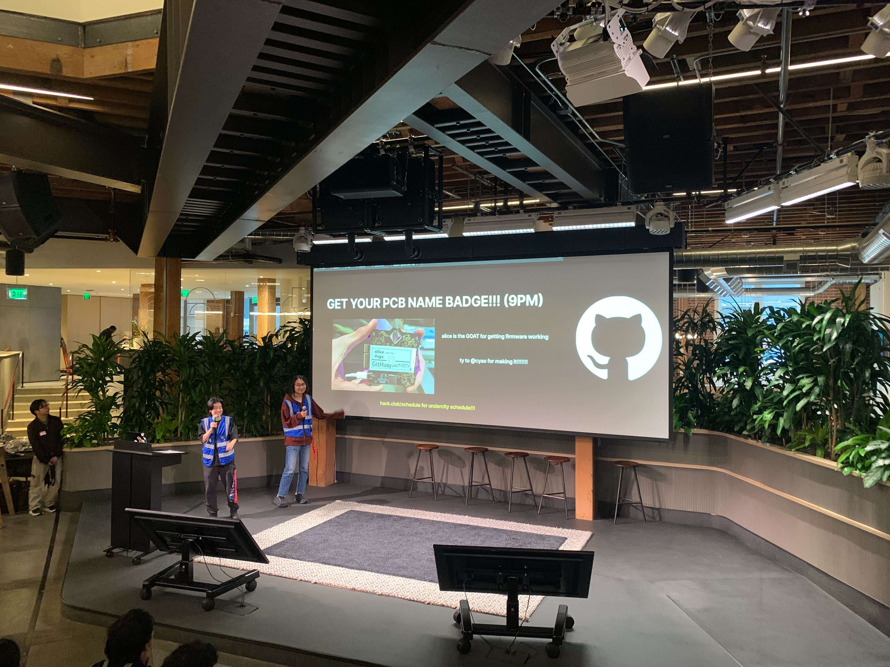
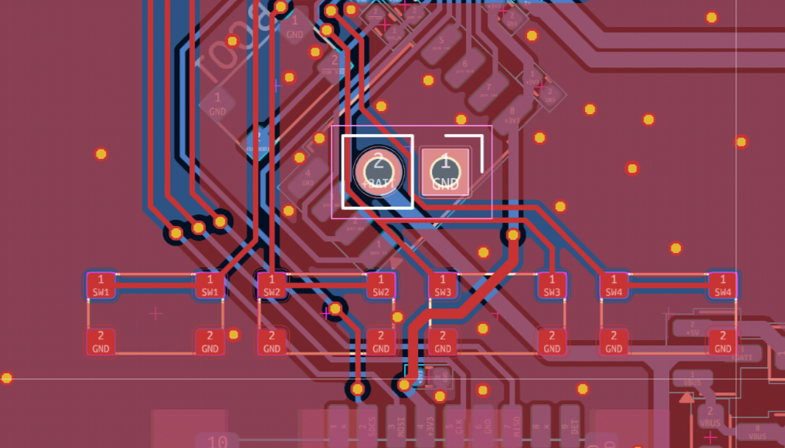

# Undercity + Github badges

Official badges for undercity (Hackathon @ Github HQ, https://highway.hackclub.com/)

Find the firmware [here](https://github.com/espcaa/undercity-lanyard)! (Start made by me, finished by spc & mpk :D)

Specs:
- 4x User buttons
- RP2350A
- Big big flash
- Super cool pcie connector
- Working firmware 
- Onboard eink module
- 6 neopixels go flash flash
- Pretty art by bnuuuuyguy!
- Awesome artline by acon (@acornitum)
- Check out pcb online [here](https://kicanvas.org/?github=https%3A%2F%2Fgithub.com%2Fcheyao%2Finkbadge%2Ftree%2Fmain%2Fhardware%2Finkbadge)

Additional battery mode avaliable! (Explosions not included this time)

Solder a lipo onto the central holes on top of the buttons - left is V+ right is GND

Licensed under Solderpad license
